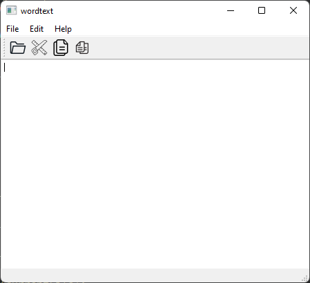

# Word Text

## ` BY : Sakassa / Benzemroun / Lakhmiri`

# Introduction

Un éditeur de texte est un logiciel destiné à la création et l'édition de fichiers textes. Chaque système d'exploitation fournit un éditeur, tant son usage est courant, voire incontournable pour certaines tâches informatiques de base comme l'administration de système et le développement de logiciels.

# Summary
- [Application Apearance](#application-apearance)

- [Menu interfaces](#menu-interfaces)

- [WordText Header](#wordtext-header)

   - [Private Slots](#private-slots)
   
   - [UI](#ui)
 
- [WordText Cpp](#wordtext-cpp)

- [Functions implementation](#functions-implementation)
  - [saveContent](#savecontent)
  - [loadContent](#loadcontent)
  
- [Slots implementation](#slots-implementation)
  - [on_actionOpen_triggered](#on-actionopen-triggered)
  - [on_actionSave_triggered](#on-actionsave-triggered)
  
  
  ## Application Apearance
  
  
  ## Menu interfaces
  
  
  
  
  
  This is the toolbar
  
  

## WordText Header
```c++
#ifndef WORDTEXT_H
#define WORDTEXT_H
#include <QMainWindow>
#include <QFileDialog>
QT_BEGIN_NAMESPACE
namespace Ui { class wordtext; }
QT_END_NAMESPACE
class wordtext : public QMainWindow
{
    Q_OBJECT
public:
    wordtext(QWidget *parent = nullptr);
    ~wordtext();
```


## Private Slots
```c++
private slots:

    void on_actionOpen_triggered();

    void on_actionSave_triggered();
```

## UI

```c++
private:
    Ui::wordtext *ui;
    QString currentFile=NULL;
      void loadContent(QString currentFile);
      void saveContent(QString currentFile) const;

};
```


## WordText Cpp
```c++
#include "wordtext.h"
#include "ui_wordtext.h"
#include <QTextStream>
wordtext::wordtext(QWidget *parent)
    : QMainWindow(parent)
    , ui(new Ui::wordtext)
{
    ui->setupUi(this);
}
wordtext::~wordtext()
{
    delete ui;
}
```

# Functions implementation

## saveContent
```c++
void wordtext::saveContent(QString filename)const
{
    //Gettign a pointer on the file
    QFile file(filename);

    //Openign the file
    if(file.open(QIODevice::WriteOnly))  //Opening the file in writing mode

    {          auto text = ui->plainTextEdit->toPlainText();

        QTextStream in(&file);


               in << text ;
           }

    file.close();
}
```

## loadContent
```c++
void wordtext::loadContent(QString filename){
    QFile file(filename);
    if (file.open(QIODevice::ReadOnly )) {
        QTextStream in(&file);
    while (!in.atEnd()) {
        QString line = in.readLine();
    ui->plainTextEdit->textCursor().insertText(line);
ui->plainTextEdit->textCursor().insertText("\n");
        // now, line will be a string of the whole line, if you're trying to read a CSV or something, you can split the string

    }
}

 // opens "/home/readme.txt" under Unix
}
```
# Slots implementation

## on_actionOpen_triggered

```c++
void wordtext::on_actionOpen_triggered()
{
    QFileDialog l ;
    currentFile= l.getOpenFileName();

      setWindowTitle(currentFile);

      loadContent(currentFile);
}
```

## on_actionSave_triggered

```c++
void wordtext::loadContent(QString filename){
    QFile file(filename);
    if (file.open(QIODevice::ReadOnly )) {
        QTextStream in(&file);
    while (!in.atEnd()) {
        QString line = in.readLine();
    ui->plainTextEdit->textCursor().insertText(line);
ui->plainTextEdit->textCursor().insertText("\n");
        // now, line will be a string of the whole line, if you're trying to read a CSV or something, you can split the string

    }
}
// opens "/home/readme.txt" under Unix
}
```
